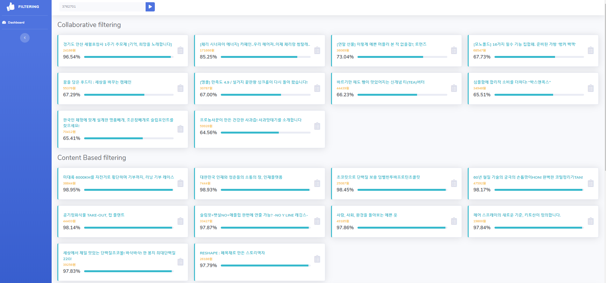
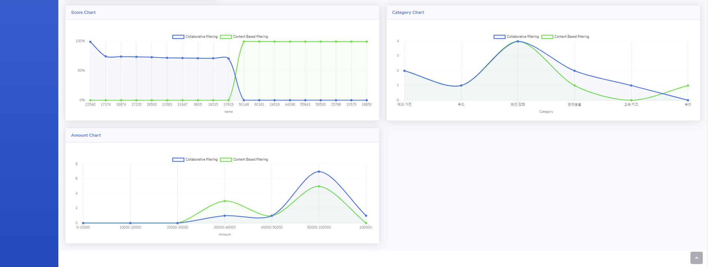

# 2020-01-group2

### Software Require
  1. Jupyter notebook
  2. Python 3.5.6
  3. hadoop 2.7.6
  4. spark 2.2.2


### Algorithms implemented and evaluated
  1. Collaborative Filtering
  2. Content based Filtering

### Installing
```sh
$ pip install -r requirements.txt
$ echo "deb https://dl.bintray.com/sbt/debian /" | sudo tee -a /etc/apt/sources.list.d/sbt.list
$ sudo apt-key adv --keyserver hkp://keyserver.ubuntu.com:80 --recv 2EE0EA64E40A89B84B2DF73499E82A75642AC823
$ sudo apt-get update
$ sudo apt-get install sbt npm
```

# Implementation


## DataAcquisition
 ### Crawling
1. 크라우드 펀딩 상품 정보 (https://www.wadiz.kr/web/main) [Data (153MB)](https://drive.google.com/file/d/1N4Fz2FsgeyE8Bi-EvBhXZ9YunGVoYy5a/view?usp=sharing)
- 상품 아이디, 상품 이름, 카테고리, 메이커, 요약, 달성률, 전체 펀딩 금액, 전체 서포터수,전체 좋아요 수, 리워드 만족도, 메이커 만족도 , 댓글, 캠페인 댓글


2. 유저 상품 정보 ( https://www.wadiz.kr/web/wmypage/myprofile/fundinglist/userId) [Data (350MB)](https://drive.google.com/file/d/1KADxby-hK6zBZOEgYEFbZfIKT4uBcNYx/view?usp=sharing)
- 유저아이디, 상품 아이디, 상품 이름, 카테고리, 펀딩 금액


3. crawling/crawling.py
```sh
$ python3 crawling/crawling.py {Raw 데이터 위치} {타입 (0:추천, 1:인기, 2:최신)} {시작페이지} {끝페이지}
$ hadoop dfs -put {Raw데이터위치}/users.csv
$ hadoop dfs -put {Raw데이터위치}/wadiz.csv
```

## DataAnalysis

### Scala
- Optimizing PySpark CosineSimilarity UDF
- Build
```sh
$ cd scala
$ sbt package
```
- target directory내에 jar 파일 생성

### Collaborative Filtering
- Using PySpark AST Module
- Usage :
```sh
$ export PYSPARK_PYTHON={PATH_TO_PYTHON3}
$ spark-submit --driver-memory 8g --executor-memory 8g --master yarn analysis/spark_CF.py
```
- Input : ```[[userid1, fundingid1, backedAmount1], [userid2, fundingid2, backedAmount2],...]```
- Output : users_CF_test.json 
``` [userid, funding_id, funding_name, category, amount, score]```
- ```web/public/data/users_CF_test.json``` 로 이동시켜야함.
- 결과 데이터는 2GB가 넘어가고 분석 시간이 오래 걸리기 때문에 testData로 구성

### Content Based Filtering
- Using Tokenizer, Word2Vec, CosineSimiliarity, Range Amount
- Usage :
```sh
$ export PYSPARK_PYTHON={PATH_TO_PYTHON3}
$ spark-submit --jars {CosineSimilarity UDF Jar파일 위치} --driver-memory 8g --executor-memory 8g --master yarn analysis/spark_CBF.py
```
- Input : ```[[userid1, fundingid1], [userid2, fundingid2],...]```
- Output : users_CBF_test.json 
``` [userid, funding_id, funding_name, category, amount, score]```
- ```web/public/data/users_CBF_test.json``` 로 이동시켜야함.
- 결과 데이터는 2GB가 넘어가고 분석 시간이 오래 걸리기 때문에 testData로 구성
- Considerted Feature : ```[name, makerName, summary, category, totalAmount, totalSupporter]```
- Preprocessing Feature: ```[soop: makerName * x + summary * y + category * z] ```, ```[avgAmount: totalAmount / totalSupporter]```

앞선 soop column에 해당하는 x, y, z의 경우는 각 column에 대한 비율을 조정하여 추천 알고리즘의 output을 달리할 수 있다. 

- Implementation
  - soop
    - Tokenizer
    - Word2Vec
    - CosineSimiliarity
    


  - avgAmount
    - 0~8 range amount
    - filter range amount  

## DataVisualization
### Tech
- Language: JavaSctripts
- Backend: Express
- Frontend: ejs, chartjs, jQuery, Ajax

### filtering.js
 - GET: cf
   - input: user_id
   - output: user_id의 Collaborative filtering Result
 - GET: cbf
   - input: user_id
   - output: user_id의 Content Based filtering Result

### index.ejs
 - item: Collaborative filtering, Content Based filtering 결과 아이템의 이름, 평균 펀딩 가격, Score
 - Score Chart: X축 결과 아이템들의 ID, Y축 아이템별 Score
 - Category Chart: X축 결과 아이템들의 카테고리, Y축 카테고리별 Count
 - Amount Chart: X축 가격의 범위, Y축 가격 범위 별 Count

### data
 - 결과 데이터는 2GB가 넘어가기 때문에 testData로 구성

# Install

```sh
$ cd web
$ npm install
$ npm start
```

# Result


 - ScoreChart를 보면 두 알고리즘이 추천하는 아이템은 완전히 다르게 나타난다는 것을 알 수 있다.
 - CategoryChart를 보면 데이터가 많은 테스트 유저이여서 비슷한 결과가 나타난다는 것을 알 수 있다.
 - AmoutChart를 보면 CBF의 경우 가격의 영향을 받아서 그래프가 형성되지만 CF의 경우 관련이 없는 결과가 나타난다는 것을 알 수 있다.
