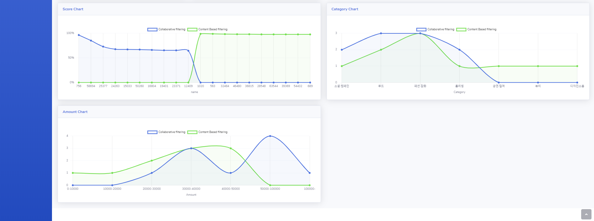

# 2020-01-group2

### Software Require
  1. Jupyter notebook
  2. Python


### Algorithms implemented and evaluated
  1. Collaborative Filtering
  2. Content based Filtering


# Implementation


## DataAcquisition
 ### Crawling
1. 크라우드 펀딩 상품 정보 (https://www.wadiz.kr/web/main)
- 상품 아이디, 상품 이름, 카테고리, 메이커, 요약, 달성률, 전체 펀딩 금액, 전체 서포터수,전체 좋아요 수, 리워드 만족도, 메이커 만족도 , 댓글, 캠페인 댓글


2. 유저 상품 정보 ( https://www.wadiz.kr/web/wmypage/myprofile/fundinglist/userId)
- 유저 아이디([유저아이디, 닉네임, 펀딩가격]), 유저 펀딩 리스트([캠페인 아이디, 이름 , 카테고리]


## DataAnalysis
### Collaborative Filtering
- Using PySpark AST Module
- Input : ```[[userid1, fundingid1, backedAmount1], [userid2, fundingid2, backedAmount2],...]```
- Output : 
```[userid, [[Funding_ID1, Score1], [Funding_ID2, Score2],...]```

### Content Based Filtering
- Using Tokenizer, Word2Vec, CosineSimiliarity, Range Amount
- Input : ```[[userid1, fundingid1], [userid2, fundingid2],...]```
- Output : 
```[userid, [[Funding_ID1, Score1], [Funding_ID2, Score2],...]```
- Considerted Feature : ```[name, makerName, summary, category, totalAmount, totalSupporter]```
- Preprocessing Feature: ```[soop: makerName * x + summary * y + ConsineSimiliarity * z] ```, ```[avgAmount: totalAmount / totalSupporter]```
- Implementation
  - soop
    - Tokenizer
    - Word2Vec
    - CosineSimiliarity

  - avgAmount
    - 0~8 range amount
    - filter range amount  

### Scala
- Optimizing PySpark CosineSimilarity UDF
- Build
```sh
$ cd scala
$ sbt package
```
- add compiled ```-jar``` parameter to spark 

## DataVisualization
### Tech
- Language: JavaSctripts
- Backend: Express
- Frontend: ejs, chartjs, jQuery, Ajax

### filtering.js
 - GET: cf
   - input: user_id
   - output: user_id의 Collaborative filtering Result
 - GET: cbf
   - input: user_id
   - output: user_id의 Content Based filtering Result

### index.ejs
 - item: Collaborative filtering, Content Based filtering 결과 아이템의 이름, 평균 펀딩 가격, Score
 - Score Chart: X축 결과 아이템들의 ID, Y축 아이템별 Score
 - Category Chart: X축 결과 아이템들의 카테고리, Y축 카테고리별 Count
 - Amount Chart: X축 가격의 범위, Y축 가격 범위 별 Count

### data
 - 결과 데이터는 2GB가 넘어가기 때문에 testData로 구성

# Install

```sh
$ cd web
$ npm install
$ npm start
```

# Result


 - ScoreChart를 보면 두 알고리즘이 추천하는 아이템은 완전히 다르게 나타난다는 것을 알 수 있다.
 - CategoryChart를 보면 데이터가 많은 테스트 유저이여서 비슷한 결과가 나타난다는 것을 알 수 있다.
 - AmoutChart를 보면 CBF의 경우 가격의 영향을 받아서 그래프가 형성되지만 CF의 경우 관련이 없는 결과가 나타난다는 것을 알 수 있다.
